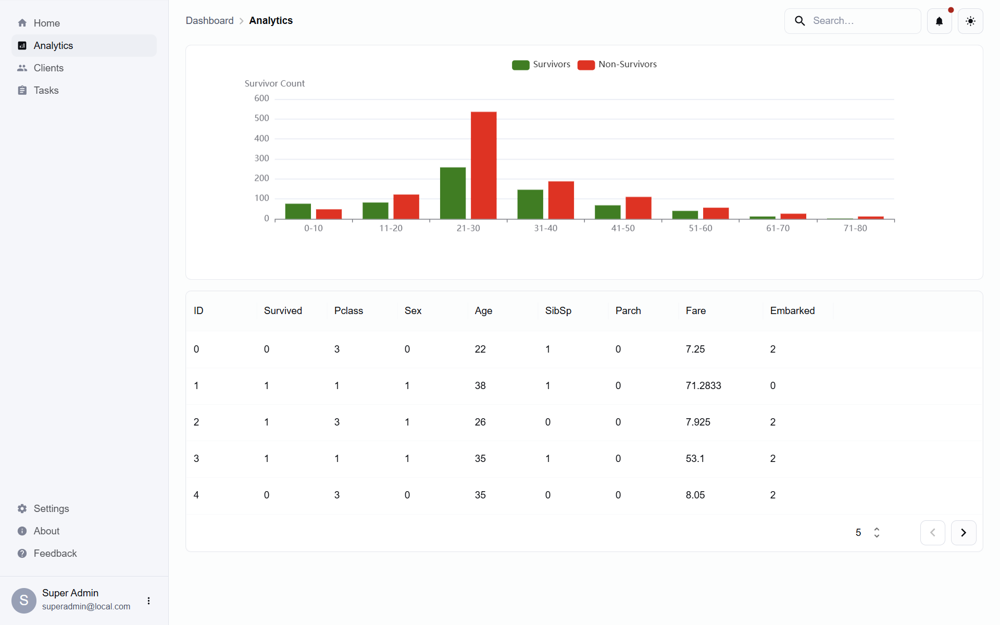
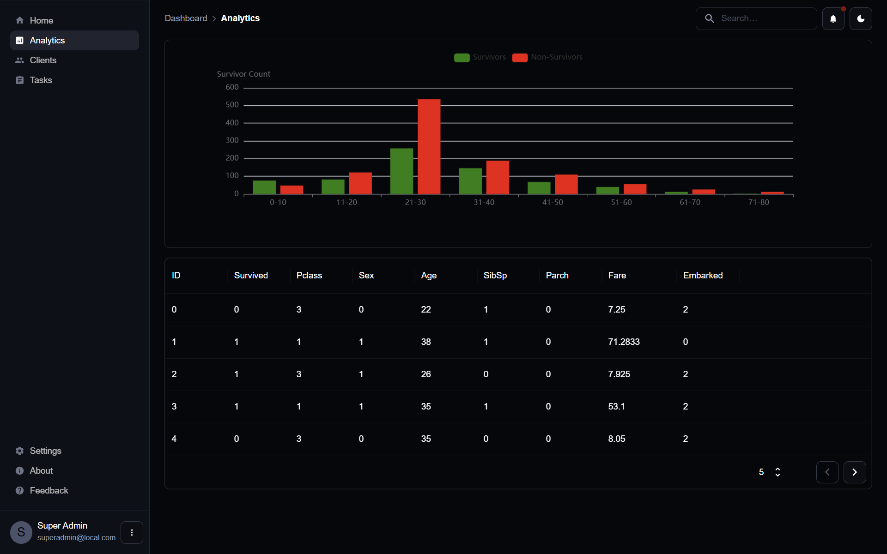

# React and Flask App

A full-stack application built with React (frontend) and Flask (backend) for data visualization of the titanic dataset.

## Screenshots

## Future Enhancements

- **User Authentication**: Add user login and registration.
- **Testing**: Add unit and integration tests.
